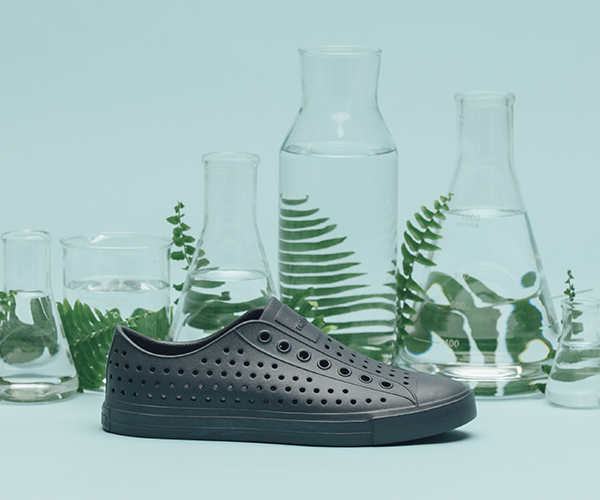

## Mission and Vision

Bloom Algae Footwear is revolutionizing the footwear industry by turning harmful algae blooms into eco-friendly materials. Bloom uses the ocean's resources to create stylish, durable, and sustainable shoes while restoring ecosystems for marine life and reducing environmental harm.

## Environmental Impact

- Water restoration:  Harvests invasive algae from waterways to improve water quality and increase biodiversity concerning marine life.  
    
- Carbon Footprint Reduction: Replaces petroleum-based materials with algae biomass, significantly decreasing CO₂ emissions.  
    
- Waste to Resource: Converts harmful algae waste into innovative materials for global footwear production.

## Driving Innovation

- Developing cutting-edge technology to expand the use of algae materials in footwear and beyond.  
    
- Collaborating with global brands to bring sustainable materials into mainstream markets.  
    
- Researching advanced algae processing techniques to improve material strength and durability.

## Progress and Achievements 

- Produced over 5 million pairs of algae-based shoes since launch.  
    
- Purified 1,685,480,000+  liters of algae-polluted water, restoring natural ecosystems.  
    
- Prevented more than 961,708 tons of CO₂ emissions through sustainable material production.

