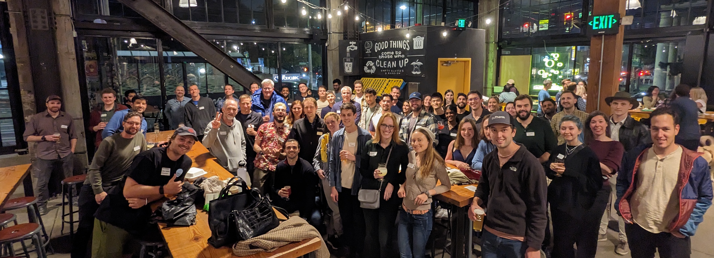

import ImageCard from '../src/components/ImageCard/ImageCard';

## The ultimate resource for hosting your local climate event

:::caution Under Construction
[Help us](../contribute) improve this page
:::

There's nothing like getting people together who share a common purpose to save humanity.

This guide will help you host events on a scale of easy happy hours to a full on festival.

## We will cover:

1. Event formats

2. Fundraising, logistics, and promotion

3. Free assets you can borrow

## Real Quick

Check to see if there are existing events and organizations you are not aware of.

- [Climate Tech Cities](https://www.climatetechcities.com/)
- [MCJ Events Calendar on Luma](https://lu.ma/u/mcj)
- Local channels in various [Slack Communities](/level-1#core-communities), for example `#meet-seattle` in the [Work on Climate Slack](https://workonclimate.org)
- General climate change meetups - 350.org chapter, green drinks, etc.
- You can also search through Eventbrite, Meetup.com, Luma, and other sites for things about climate change

## Event Guides

Pick a format below, organized by the amount of effort:

### Easiest Effort - informal gathering

    <ImageCard
    title="Happy hour"
    description="Find a place and tell people to show up"
    imageUrl="/img/climate-tech-happy-hour.jpg"
    linkUrl="/event-format-happy-hour"
    />
    <ImageCard
    title="Co-working session"
    description="Like a Happy Hour but people bring laptops"
    imageUrl="/img/climate-tech-co-working-seattle.jpg"
    linkUrl="/event-format-co-working-session"
    />
    <ImageCard
    title="City park"
    description="Take advantage of a nice day and invite some folks"
    imageUrl="/img/women-in-climate-seattle.jpg"
    linkUrl="/event-format-city-park"
    />

### Medium Effort

    <ImageCard
    title="Expert Panel"
    description="A great way to build and amplify new ideas"
    imageUrl="/img/climate-panel-seattle.jpg"
    linkUrl="/event-format-expert-panel"
    />
    <ImageCard
    title="Coffee Crawl"
    description="Post a walking route and stop at a variety of coffee joints"
    imageUrl="/img/climate-coffee-crawl.jpg"
    linkUrl="/event-format-coffee-crawl"
    />
    <ImageCard
    title="Trivia Night"
    description="People love a friendly competition with a dash of humor"
    imageUrl="/img/climate-tech-trivia-night.jpg"
    linkUrl="/event-format-trivia-night"
    />

### Rock star achievement

This will take some work but it can be the most rewarding.

    <ImageCard
    title="Lightning talks"
    description="Put on a great show and learn a ton"
    imageUrl="/img/climate-lightning-talks.jpg"
    linkUrl="/event-format-lightning-talks"
    />
    <ImageCard
    title="Outdoor Excursion"
    description="Bond in a new environment"
    imageUrl="/img/climate-ski-trip.jpg"
    linkUrl="/event-format-outdoor-excursion"
    />
    <ImageCard
    title="Climate Day / Week"
    description="Paint the town green!"
    imageUrl="/img/pnw-climate-week-event.png"
    linkUrl="/event-format-climate-day-or-week"
    />

## Honorable Mentions

- Speed dating
- Founders potluck
- Weekend retreat
- Pickleball

---

## Acknowledgements

- [MCJ Guide](https://docs.google.com/document/d/1wRzbTbouCaz_gdQ6bW7qaDNa1gk8M3pJkuTjJoYbPk8/edit#)

- [Lowell's Guide](https://www.notion.so/Organizing-a-Climate-Meetup-2c7005194d4b4c6f954231668432f7b3?pvs=4)