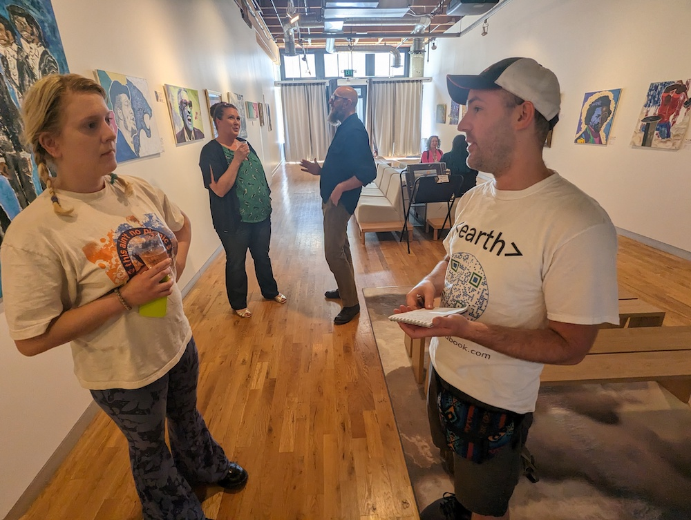

There are so many fantastic events going on in Seattle, **you'll never make them all**.

Let us cover it for you! ✍️

Sign up below and **we'll reach out to see what you want included** in your special report.

## Example Coverage

- [Climate Tech Investor Panel & Report from Silicon Valley Bank](https://www.linkedin.com/feed/update/urn:li:activity:7224526092621987840/)

- [Local Seattle Tech Accelerators](https://www.linkedin.com/feed/update/urn:li:activity:7224869709203038208)

## Next Event

<!-- - [☀️ The Burien Solar Punk Festival](#%EF%B8%8F-the-burien-solar-punk-festival-sat-aug-8) (Sat Aug 10) -->

<!-- - [⚡️ PNW DERs: September Meetup](#%EF%B8%8F-pnw-ders-september-meetup-tue-sep-17) (Tue Sep 17) -->

:::info Let us know what you want
### Write to `feedback@climatetechhandbook.com` and request an event for us to cover

**[You have a lot of great options right here](https://seattleclimate.tech/)**
:::

<!-- ## ☀️ The Burien Solar Punk Festival (Sat Aug 8)

“Solar Punk” envisions a future where community and technology are integrated to create a self-sustaining system. 

Attendees will learn about alternative self-sustaining ways to work and power their daily lives.

It is an iconic one-day event that celebrates the best of Burien and empowers the community by bringing eco-friendly businesses together to showcase what they do and connect them to the community as potential employers

Can't make it? Drop a few bucks, and we'll give you a special summary report!

<a href="https://square.link/u/pGK8PWKz" class="doc-button" target="_blank" rel="noopener noreferrer">$ Contribute 🙏</a>
 -->
## ⚡️ PNW DERs: September Meetup (Tue Sep 17)

### [Event Page](https://lu.ma/rtnvum09)

Come join the PNW DER community for our September meetup! We will be providing group updates and hosting a community presentation (topic TBD).

Can't make it? Drop a few bucks, and we'll give you a special summary report!

<a href="https://square.link/u/pGK8PWKz" class="doc-button" target="_blank" rel="noopener noreferrer">$ Contribute 🙏</a>

### One last thing

:::note Opportunity
If you want to be a reporter, write to `feedback@climatetechhandbook.com`
:::