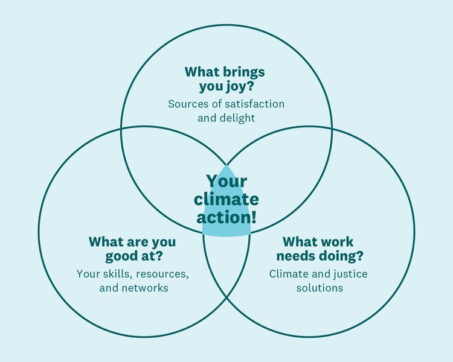

import ImageCard from '../src/components/ImageCard/ImageCard';

## Welcome to the Climate Tech Handbook's Mini Course!

### **This mini-course will help you find:** 

1. A **climate solution** that fits you
2. An **organization** working to solve it
3. A **job offer** that is right for you
4. **Success your first 90 days** of working

### Why do climate tech jobs matter?

#### The harsh reality is:

- We are _5 years_ from reaching a global temperature of **1.5 degrees Celsius (or 2.7 degrees Fahrenheit)**. 
- We need to _reduce greenhouse pollution_ by **50% before 2030 and 100% by 2050**.
- We are already experiencing _millions of deaths per year_ and **billions of economic damages thus far**. Each year this number is increasing (this is being tracked by [Yale Climate Connections](https://yaleclimateconnections.org)).

####  Despite this, though, there is still hope. Currently:

- There are **more than 4,000 companies** solving the climate crisis.
- Many of these companies are _always hiring_.
- **Hundreds of billions of dollars** are being used to solve this problem, and _much more is coming_!

---

## Task 1: Complete the Climate Crisis Venn Diagram

**Complete as much of the Venn Diagram as you can.** If this mini-course will have taught you anything by the end, you will be able to complete the circle: What work needs doing? We will remind you to circle back to it once you have found the right solution to work on.

You can complete this in a document or on paper. **Be sure to keep it saved**.

_Climate Action Venn Diagram - by [Ayana Elizabeth Johnson](https://www.ayanaelizabeth.com/climatevenn)_

## Next Up: How to Use the Handbook

<!-- only link to how to use the handbook, not the other levels because everyone, regardless of their level, should get an intro on the handbook and its uses -->

    <ImageCard
    title="How to use the Handbook"
    description="An introduction to our free one hour mini-course"
    imageUrl="/img/starting-line.jpg"
    linkUrl="../how-to-use-the-handbook"
    />

