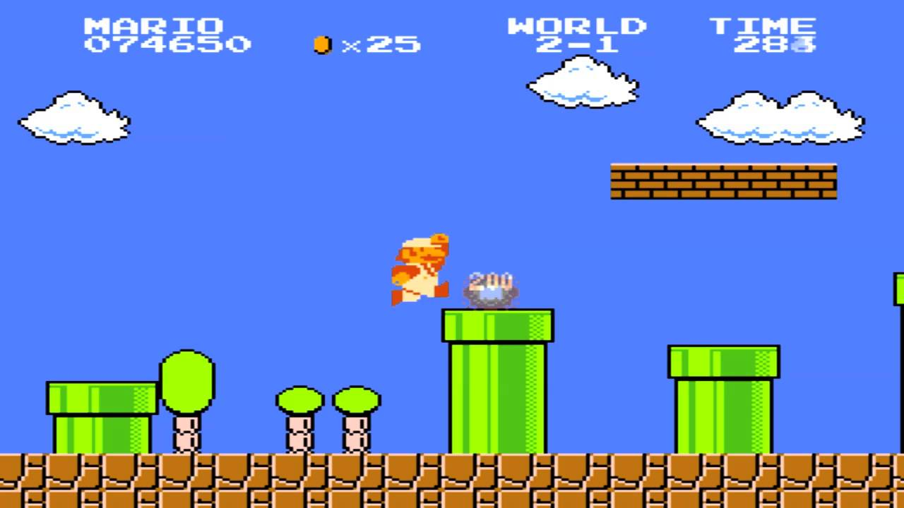

import ImageCard from '../src/components/ImageCard/ImageCard';

## Definition of LEVEL 1

:::info Level 0
**Stay here if you**:

- Understand the basics from [Level 0](level-0)

- You're committed to working on climate and need to hone in on a [Solution](#pick-your-climate-solution)

- You need to build a solid [Information Diet](#start-your-information-diet) into your weekly routine 
:::

### Wrong level?

    <ImageCard
    title="Back to Level 0"
    description="You still need the basics"
    imageUrl="img/climate-tech-level-0-mario.jpg"
    linkUrl="/level-0"
    />
    <ImageCard
    title="Skip to Level 2"
    description="You already picked your climate solution"
    imageUrl="img/level-2-mario.jpg"
    linkUrl="/level-2"
    />

## Lesson Start

:::note Lesson Overview
### In this lesson you will:
- Pick a climate solution to research

- Build your daily and weekly information diet

- Build your profile and networking strategy
:::

## Pick your climate solution

You may be tempted to apply for any open roles, regardless of their industry domain.

**This is not recommended.**

You should try to narrow down your focus to a specific solution.

:::note Why pick a specific solution?
This is a critical step for you to:
1. **Manage your time** -  research top challenges that you are uniquely positioned to solve

2. **Build your network** - offer something to contribute for a specific community
:::

## Solution Frameworks

In [Level 0](level-0) you learned about the two primary frameworks:

- [Project Drawdown](level-0#project-drawdown)

- [Speed and Scale](level-0#speed-and-scale)

They are all listed in The Handbook under our [Solutions Page](Solutions).

<ImageCard
  title="Climate Solutions"
  description="An overview of all 12 sectors and 93 climate solutions"
  imageUrl="/img/aigen-robotics.png"
  linkUrl="/solutions"
/>

### Where to begin?

Take a moment to browse, and then come back to this page to plan your Information Diet.

### What to look for

- **Job openings** - every [Solutions](solutions) page has a link to job openings by that particular Solution or Sector.

- **Transferrable Skills** - some [Solutions](solutions) are very software specific and easier to transfer over from a similar IT role.

<!-- ??climate papa article. -->

- **Industry risk** - some industries are better established, like electric vehicles and solar. Other solutions are earlier stage or have more volatility such as carbon markets.

- **Co-benefits** - climate change is not our only ecological emergency. We also have a biodiversity crisis. Some solutions offer multiple benefits, such as land conservation and regenerative agricultural which can solve more than one problem. We must also incorporate solutions that intersect with other social challenges like poverty and inequity.

<!-- ### Example Trends

- **Electric vehicles** - 

- **Electric utilities** - 

- **Solar** - 

- **Heat Pumps** -

- **Hydrogren** - 

- **Food and Agriculture**

These are just a few examples to get you thinking. -->

:::tip don't overthink it
Climate tech is the next industrial revolution.

**Every single thing we do has to be completely transformed.**

It's more important that you start on something immediately and not spin your wheels too much.

:::

## Start your Information Diet
:::note What is that?
Your daily and weekly routine.

You'll need 2-10 hours per week to find a [Solution](solutions) and stay up to speed on the latest news.
:::

### Resource page

Our complete set of resources are listed on our [Resources page](resources).

Read below for guidance so you aren't overwhelemed.

<ImageCard
  title="Resources"
  description="Newsletters, podcasts, media coverage, and other materials."
  imageUrl="/img/healthy-lifestyle.jpg"
  linkUrl="/resources"
/>

### Speed and Scale - OKR Tracker

The Speed and Scale website has an [OKR Tracker](https://speedandscale.com/tracker/).

OKR = Objective Key Results.

This is a curated news feed to track progress on particular solution.

**Examples:**

- Farm [soil health](https://speedandscale.com/okrs/3-0-fix-food/3-1-farm-soils/), and alternative [fertilizers](https://speedandscale.com/okrs/3-0-fix-food/3-2-fertilizers/).

- [Alternative Cement](https://speedandscale.com/okrs/5-0-clean-up-industry/5-2-cement/)

- [Policy battles](https://speedandscale.com/okrs/7-0-win-politics-and-policy/)

### Newsletters and Podcasts

There are many to choose from on our [Resources Page](resources).

**Examples:**

- [Catalyst](https://www.canarymedia.com/podcasts/catalyst-with-shayle-kann) with Shayle Kahn

- The [My Climate Journey Podcast](https://www.mcjcollective.com/media/podcast)

- [Volts](https://volts.wtf) (Electricity focused)

:::tip
Find specific episodes _within_ a podcast that pertain to your solution.

Also, look for episodes featuring founders from your Top 10 list of companies.
:::

**Examples:**

- You want to learn about electricity challenges: listen to an episode like ["Navigating the electrification gauntlet"](https://www.canarymedia.com/podcasts/catalyst-with-shayle-kann/navigating-the-electrification-gauntlet).

- You want to understand decarbonizing steel: [listen to an episode featuring the founder of Electra](https://www.mcjcollective.com/my-climate-journey-podcast/electra), and add them to your Top 10 company list.

### Topics within a community

The [Work on Climate Slack community](workonclimate.org) has channels based on topics and locations.

:::info Example topics and locations
- [#learn-built-environment](https://app.slack.com/client/T017M28BLSG/C033K3U1ZQR)

- [#learn-food-waste](https://workonclimate.slack.com/messages/C01K3JV2LNQ)

- [#meet-seattle](https://workonclimate.slack.com/archives/C02EXRJPS66)
:::

## You did it!

You should now have some ideas on where to source your Information Diet and build a study habit for 2-10 hours per week.

Now on to the FINAL level:

    <ImageCard
    title="Start Level 2"
    description="Pick your TOP 10 companies"
    imageUrl="img/level-2-mario.jpg"
    linkUrl="/level-2"
    />

 

:::contribute [Help us](contribute) improve this page
:::
