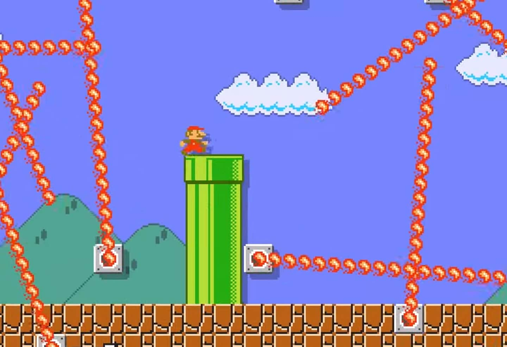

import ImageCard from '../src/components/ImageCard/ImageCard';

## Definition of LEVEL 1

:::info Level 2
**Stay here if you**:

- Understand the basics from [Level 0](level-0)

- You're committed to working on climate and need to hone in on a [Solution](#pick-your-climate-solution)

- You need to build a solid [Information Diet](#start-your-information-diet) into your weekly routine 
:::

### Wrong level?

    <ImageCard
    title="Back to Level 1"
    description="You need to explore climate solutions"
    imageUrl="img/level-1-mario.jpg"
    linkUrl="/level-1"
    />
    <ImageCard
    title="Back to Level 0"
    description="You still need the basics"
    imageUrl="img/climate-tech-level-0-mario.jpg"
    linkUrl="/level-0"
    />

## Lesson Start

:::note Lesson Overview
### In this lesson you will:
- Pick a climate solution to research

- Get to know 10 companies within that solution

- Build your daily and weekly information diet

- Build your profile and networking strategy
:::