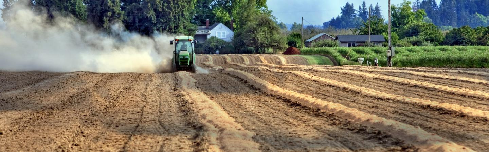

_Image credit: ([MIT Climate Portal)](https://climate.mit.edu/explainers/soil-based-carbon-sequestration)_
:::info [Help us track this topic](contribute)
[Click here to contribute content and feedback](contribute)
:::

## The Big Question:

To what degree should nature-based solutions be a part of carbon markets?

**Additionally**:

 - Should we as an industry be trying to fund things like [regenerative agriculture](solution-regenerative-annual-cropping) and forestry with carbon credits?

 - Or should we fund those things via government programs or philanthropy? 

 - If its a mixture of both, where is the line?

:::tip Check out Nori
[Nori is a Seattle company](nori.com) working on carbon removal by partnering with farmers who can sell soil carbon

**[See if they're hiring](https://nori.com/careers)**
:::

## Finding answers

- [Addressing the Nature Financing Gap](https://www.iisd.org/articles/insight/addressing-nature-financing-gap) by Edoardo Carlucci.

- [Financing Nature: Closing the Global Biodiversity Financing Gap](https://www.paulsoninstitute.org/conservation/financing-nature-report/)