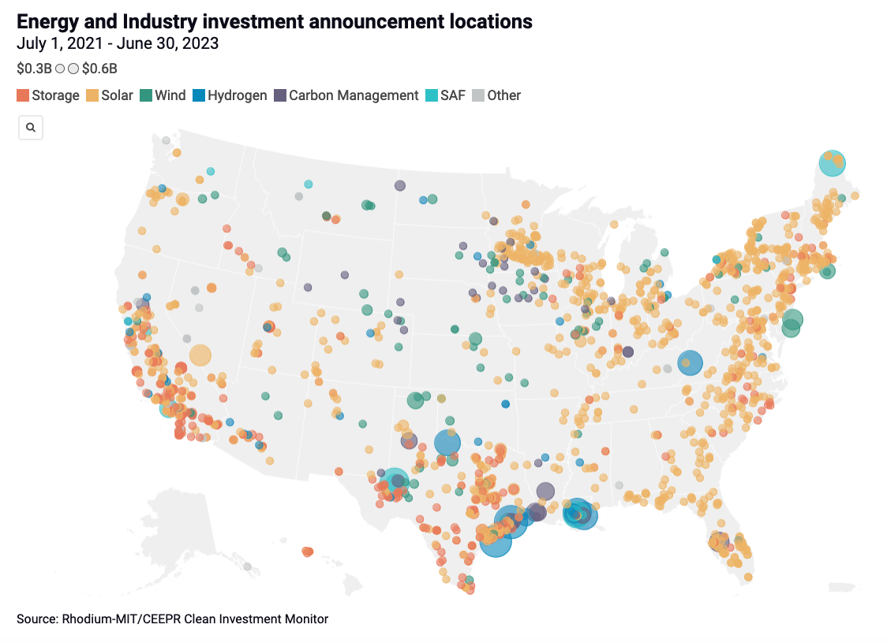

## Sector Overview

:::company Job openings
### [View open jobs in this Sector](https://climatebase.org/jobs?l=&q=&sectors=Advocacy+or+Policy&p=0&remote=false)

<!--This is the best strategy to accelerate your expertise as a top candidate-->
:::

Technology alone will not be able to solve the climate crisis.

We also need policies to support research, deployment, and public education for critical solutions.

## The Inflation Reduction Act

The Inflation Reduction Act of 2022 is the largest investment in climate action in U.S. history, with [$369 billion](https://www.usatoday.com/story/money/2023/05/25/guide-to-the-inflation-reduction-act/70249464007/) in energy security and climate change resilience investments.

:::question
What is the impact of these policies?
:::
This is being tracked in two places:
:::tip Resource

- [Clean Investment Monitor](https://www.cleaninvestmentmonitor.org/) - Rhodium Group / MIT’s Center for Energy and Environmental Policy Research (CEEPR)

- [Jack Conness's Dashboard](https://www.jackconness.com/ira-chips-investments).
:::

<iframe 
  allow="autoplay *; encrypted-media *; fullscreen *; clipboard-write" 
  frameBorder="0" 
  height="175" 
  style={{width:'100%', maxWidth:'660px', overflow:'hidden', borderRadius:'10px'}} 
  sandbox="allow-forms allow-popups allow-same-origin allow-scripts allow-storage-access-by-user-activation allow-top-navigation-by-user-activation" 
  src="https://embed.podcasts.apple.com/us/podcast/how-is-u-s-industrial-policy-affecting-actual-climatetech/id1593204897?i=1000631066489"
/>

_Click the map below to view on The Clean Investment Monitor_

## Climate Risk Frameworks

<iframe width="560" height="315" src="https://www.youtube-nocookie.com/embed/_TptvxMf31A?si=UPQKpOEsxtj0rsNW" title="YouTube video player" frameborder="0" allow="accelerometer; autoplay; clipboard-write; encrypted-media; gyroscope; picture-in-picture; web-share" allowfullscreen></iframe>

<!-- 
## Government roles

--like Seattle City Light fleet management -->