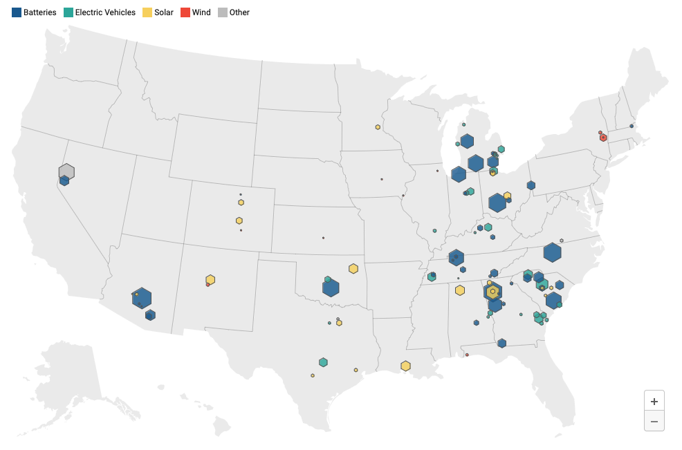

## Sector Overview

:::company Job openings
#### [View open jobs in this Sector](https://climatebase.org/jobs?l=&q=&sectors=Advocacy+or+Policy&p=0&remote=false)

<!--This is the best strategy to accelerate your expertise as a top candidate-->
:::

Technology alone will not be able to solve the climate crisis.

We also need policies to support research, deployment, and public education for critical solutions.

## The Inflation Reduction Act

The Inflation Reduction Act of 2022 is the largest investment in climate action in U.S. history, with [$369 billion](https://www.usatoday.com/story/money/2023/05/25/guide-to-the-inflation-reduction-act/70249464007/) in energy security and climate change resilience investments

:::tip Resource
Investment dollars and job creation numbers are being [tracked by Jack Conness here](https://www.jackconness.com/ira-chips-investments).
:::

<!-- 
## Government roles

--like Seattle City Light fleet management -->