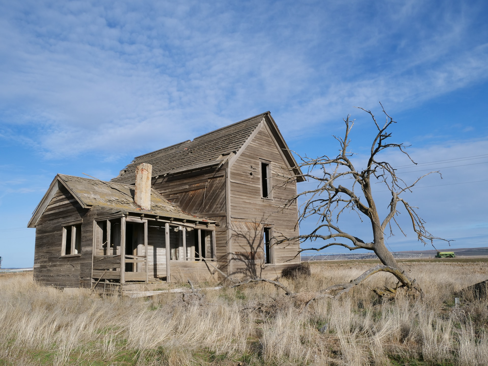

Restoring abandoned farmland offers significant potential for mitigating climate change by sequestering carbon and improving biodiversity. This solution involves reclaiming and revitalizing formerly cultivated lands that have been left unused.

:::company Job Opportunities
[Explore job postings on Climatebase](https://climatebase.org/jobs?l=&q=abandoned+farmland+restoration&p=0&remote=false)

**Example Companies / Organizations**

* [The Nature Conservancy](https://www.nature.org/) - Global conservation organization working on land and water preservation
* [Ecosystem Restoration Camps](https://ecosystemrestorationcamps.org/) - Non-profit focused on restoring degraded landscapes worldwide
* [Commonland](https://www.commonland.com/) - Organization dedicated to large-scale landscape restoration
* [Dendra Systems](https://dendra.io/) - uses drones and AI for large-scale ecosystem restoration, including abandoned farmlands

:::

## Overview

Abandoned farmland restoration involves reclaiming and revitalizing formerly cultivated lands that have been left unused. This process can help mitigate climate change by:

1. Sequestering carbon in soil and vegetation
2. Improving biodiversity and ecosystem services
3. Reducing pressure on existing natural habitats

## Progress Made

Recent studies have highlighted the potential of abandoned farmland restoration for climate change mitigation:

* Researchers have used satellite imagery to track abandonment and recultivation of cropland over time.
* A study in Nature found that abandoned farmland in Europe could store up to 177 million tons of carbon per year.
* Projects like LIFE Regenerate in Spain are restoring abandoned farmland to improve soil quality and biodiversity.

## Solutions by Sector

### Agriculture

* Agroforestry systems on abandoned lands
* Cover cropping and no-till farming practices
* Precision agriculture for optimized resource use

**Case Studies:**

1. [The Nature Conservancy's Indiana Project](https://www.nature.org/en-us/about-us/where-we-work/united-states/indiana/stories-in-indiana/restoring-abandoned-farmland-to-benefit-nature-and-people/) - Restored 400 acres of abandoned farmland, improving water quality and wildlife habitat.
2. [Ecosystem Restoration Camps in Spain](https://ecosystemrestorationcamps.org/camp/altiplano-restoration-camp/) - Transformed degraded farmland into a thriving ecosystem using permaculture techniques.
3. [Commonland's Landscape Restoration in South Africa](https://www.commonland.com/landscapes/baviaanskloof-south-africa/) - Restored 550,000 hectares of degraded land, benefiting local communities and biodiversity.

### Forestry

* Reforestation of abandoned agricultural lands
* Assisted natural regeneration
* Mixed-species plantations

**Case Studies:**

1. [The American Chestnut Foundation's Restoration Project](https://acf.org/) - Reintroducing blight-resistant American chestnut trees to former agricultural lands.
2. [Plant-for-the-Planet's Trillion Tree Campaign](https://www.trilliontreecampaign.org/) - Global reforestation effort including abandoned farmland restoration.
3. [Green Belt Movement in Kenya](https://www.greenbeltmovement.org/) - Community-based tree planting on degraded lands, including former farmlands.

### Technology

* Remote sensing for identifying restoration opportunities
* Drone-based seeding and monitoring
* AI-powered landscape analysis and planning

**Case Studies:**

1. [Dendra Systems](https://www.dendra.io/) - Using drones and AI for large-scale ecosystem restoration, including abandoned farmlands.
2. [Land Life Company](https://landlifecompany.com/) - Employing technology-driven approaches to reforest degraded lands efficiently.
3. [Restor](https://restor.eco/) - Providing a science-based platform for global ecosystem restoration planning and monitoring.

## Lessons Learned

1. Long-term commitment is crucial for successful restoration
2. Addressing socioeconomic and political barriers is essential
3. Incentivizing farmers to abandon unproductive land can accelerate restoration efforts
4. Funding for habitat restoration projects is critical

## Challenges Ahead

1. Policies requiring continuous land cultivation
2. Lack of funds for habitat protection
3. Negative cultural perspectives on "messy" restored landscapes
4. Socioeconomic and political barriers to habitat regeneration

## Best Path Forward

1. Invest in ecological restoration of abandoned farmlands
2. Develop policies supporting long-term land abandonment and restoration
3. Allocate funds for habitat protection and restoration projects
4. Educate the public on the benefits of restored landscapes
5. Address socioeconomic barriers to encourage restoration efforts

:::info Learn More

* [The Nature Conservancy - Restoring Abandoned Farmland](https://www.nature.org/en-us/about-us/where-we-work/united-states/indiana/stories-in-indiana/restoring-abandoned-farmland-to-benefit-nature-and-people/)
* [European Union's Common Agricultural Policy](https://ec.europa.eu/info/food-farming-fisheries/key-policies/common-agricultural-policy_en)
* [LIFE Regenerate Project](https://www.liferegenerate.eu/)
  :::