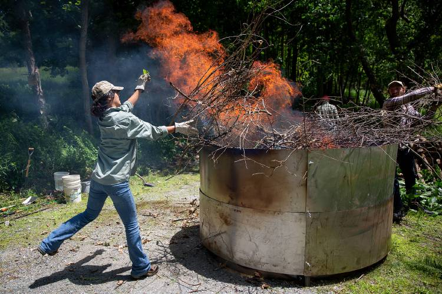

:::info [Help us track this Solution](contribute)
This a sample ChatGPT page to get the ball rolling.

[Click here to contribute content and feedback](contribute)
:::

_Biochar helps farmers get more life out of dead plants_ ([vnews.com](https://www.vnews.com/Biochar-Demonstration-Offers-Alternative-to-Burn-Piles-46911424))

        
List of companies working in this solution...

         <em>Note: this is an experimental feature. Accuracy not guaranteed</em>
        

            <ul>
             
                <li><a href="https://geltor.com/">Geltor</a></li>
            
                <li><a href="https://www.carboculture.com/">Carbo Culture</a></li>
            
            </ul>
        

        

:::company job openings
  #### [View open jobs in this Solution](https://climatebase.org/jobs?l=&q=&drawdown_solutions=Biochar+Production)
:::

## Overview

Biochar retains most of the carbon produced by decomposing biomass.

Significant progress has been made toward efficient biochar production methods, carbon capture and storage, and emission-reducing agricultural practices. Organizations like the Biochar Industry Consortium, International Biochar Initiative, Carbon Sequestration Leadership Forum, and Climate Change Mitigation Initiative have been at the forefront of this solution.

## Progress Made

- Low-emission biochar kilns using renewable energy sources have revolutionized biochar production.
- Techniques for rapid production and utilization of agricultural waste as feedstock have enabled large-scale, environmentally friendly biochar production.
- Companies leading the way in biochar production include CarbonCure Technologies, Blue Planet Ltd, and International Biochar Initiative.

## Lessons Learned

- Biochar production requires renewable energy sources and accounting for greenhouse gas emissions.
- Matching biochar type with soil and crop needs is essential for improving fertility and yields.
- Ensuring uncontaminated biochar is crucial when using it for air and water pollutant adsorption.
- International Biochar Initiative (IBI) and Biochar Solutions Initiative (BSI) are prominent organizations promoting biochar's use.

## Challenges Ahead

- Lack of standardized biochar definition hampers comparison and reliable impact assessment.
- Limited data on long-term soil and plant effects, as well as potential environmental contamination.
- Insufficient infrastructure and technical expertise hinder scalability and dissemination.
- Overcoming these challenges requires research, development, stakeholder involvement, and effective regulation.

## Best Path Forward

- Continued investment in research and development to enhance technology affordability.
- Raising awareness among the public and policymakers about biochar benefits.
- Encouraging government and business investment in biochar projects.
- Establishing standards, certification programs, and incentives for adoption.
- Key organizations leading the way include International Biochar Initiative, Biochar Solutions Initiative, and Biochar Fund.
