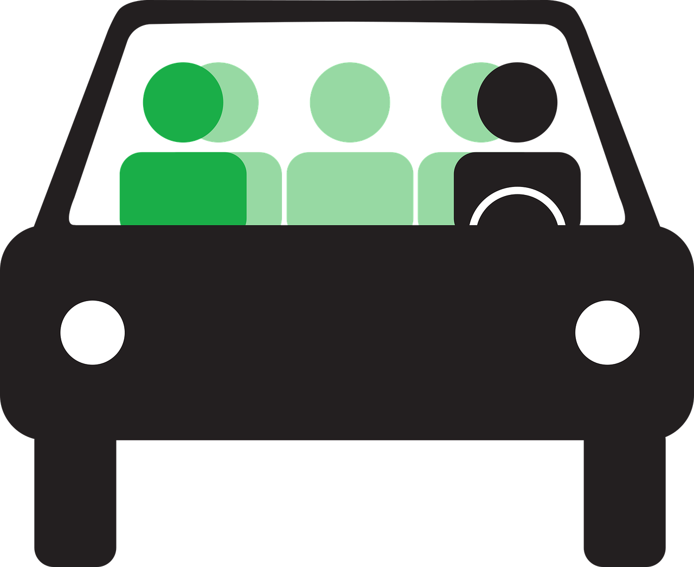

Carpooling is a sustainable transportation solution that reduces individual car usage, traffic congestion, and greenhouse gas emissions by sharing rides among multiple passengers.

:::company job openings
### [View open jobs in this Solution](https://climatebase.org/jobs?l=&q=&drawdown_solutions=Carpooling)
#### Example Companies
- [BlaBlaCar](https://www.blablacar.com/) - Long-distance carpooling platform connecting drivers with empty seats to passengers looking for a ride.
- [Waze Carpool](https://www.waze.com/carpool/) - Ride-sharing service that connects drivers and passengers with similar routes.
- [Scoop](https://www.takescoop.com/) - Enterprise carpooling solution for commuters.
- [Klaxit](https://www.klaxit.com/) - Short-distance carpooling app for daily commutes.
- [GoKid](https://www.gokid.mobi/) - Carpooling solution for schools and families.
:::

## Overview

Carpooling involves sharing car journeys so that more than one person travels in a car, reducing the number of vehicles on the road. This practice helps decrease traffic congestion, parking demands, and air pollution while also saving money on fuel and vehicle costs for participants.

:::info Learn More
- [U.S. Department of Energy - Carpooling and Car Sharing](https://afdc.energy.gov/conserve/ridesharing.html)
- [European Environment Agency - Car Sharing and Carpooling](https://www.eea.europa.eu/publications/the-first-and-last-mile/car-sharing-and-carpooling)
- [World Resources Institute - The Benefits of Carpooling](https://www.wri.org/insights/benefits-carpooling-infographic)
:::

## Progress Made

1. **App-based Services**: Technologies like Uber, Lyft, and Waze have made carpooling more convenient and accessible.
2. **HOV Lanes**: High-Occupancy Vehicle (HOV) lanes incentivize carpooling, reducing congestion and emissions.
3. **Corporate Initiatives**: Many companies now offer carpooling programs and incentives for employees.

## Solutions by Sector

### Urban Commuting
- **Dynamic Ride-Matching**: Real-time apps that match drivers and passengers for daily commutes.
- **Flexible Pickup Points**: Designated areas for safe and efficient passenger pickup and drop-off.
- **Integration with Public Transit**: Seamless connections between carpools and public transportation.

**Case Studies:**
1. **Scoop in the San Francisco Bay Area**: Partnered with local employers to reduce single-occupancy vehicle trips by 50% for participating companies ([Scoop](https://www.takescoop.com/)).
2. **Klaxit in France**: Collaborated with local authorities to subsidize carpooling trips, resulting in a 60% increase in carpooling adoption ([Klaxit](https://www.klaxit.com/)).
3. **GoKid in New York**: Implemented a school carpool program that reduced school traffic by 30% and CO2 emissions by 375 tons annually ([GoKid](https://www.gokid.mobi/)).

### Long-Distance Travel
- **Inter-City Carpooling**: Platforms connecting drivers and passengers for long-distance trips.
- **Event-Based Carpooling**: Ride-sharing services for concerts, festivals, and sporting events.
- **Vacation Ride-Sharing**: Carpooling options for tourists and travelers.

**Case Studies:**
1. **BlaBlaCar in Europe**: Facilitated over 89 million passengers in 2019, saving an estimated 1.6 million tons of CO2 ([BlaBlaCar](https://www.blablacar.com/)).
2. **Zimride for Universities**: Implemented a carpooling platform for college students, reducing campus parking demand by 15% ([Zimride](https://www.zimride.com/)).
3. **Waze Carpool for Events**: Partnered with music festivals to reduce event-related traffic by up to 20% ([Waze](https://www.waze.com/carpool/)).

### Corporate Carpooling
- **Employee Ride-Matching**: Internal platforms for connecting coworkers with similar commutes.
- **Carpool Incentive Programs**: Rewards and benefits for employees who participate in carpooling.
- **Corporate Shuttle Services**: Company-provided transportation for employees in high-density areas.

**Case Studies:**
1. **Google's gPool Program**: Reduced single-occupancy vehicle trips by 9% through an internal carpooling platform ([Google](https://sustainability.google/progress/projects/carpool/)).
2. **Salesforce's Carpool Program**: Achieved a 20% reduction in employee commute emissions through carpooling incentives ([Salesforce](https://www.salesforce.com/company/sustainability/)).
3. **SAP's TwoGo Platform**: Implemented a global carpooling solution, saving over 500 tons of CO2 emissions annually ([SAP](https://www.sap.com/corporate/en/company/sustainability-csr.html)).

## Lessons Learned

1. **User Experience**: Successful carpooling platforms prioritize ease of use and reliability.
2. **Safety Measures**: Implementing user verification and rating systems increases trust and adoption.
3. **Incentives Matter**: Financial and non-financial incentives significantly boost participation rates.
4. **Integration is Key**: Connecting carpooling with other transportation modes enhances overall effectiveness.

## Challenges Ahead

1. **Behavior Change**: Overcoming the cultural preference for personal vehicle ownership and use.
2. **Rural Areas**: Expanding carpooling services to less densely populated regions.
3. **Regulatory Hurdles**: Navigating varying transportation laws and insurance requirements across jurisdictions.
4. **Privacy Concerns**: Addressing data protection and personal information sharing issues.

## Best Path Forward

1. **Technological Innovation**: Develop advanced AI and machine learning algorithms for more efficient matching and routing.
2. **Policy Support**: Implement supportive policies such as tax incentives, HOV lanes, and parking privileges for carpoolers.
3. **Public-Private Partnerships**: Collaborate with governments, employers, and transportation agencies to create comprehensive carpooling ecosystems.
4. **Education and Awareness**: Launch campaigns to highlight the environmental and economic benefits of carpooling.
5. **Integration with Mobility-as-a-Service (MaaS)**: Incorporate carpooling into broader MaaS platforms for seamless multi-modal transportation.

*Image credit: [Unsplash](https://unsplash.com/photos/carpooling)*
