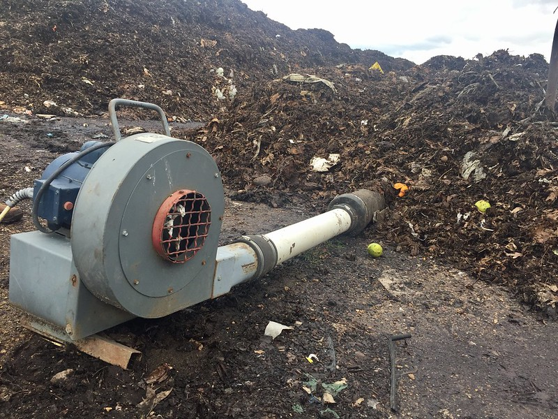

_Aerating a compost pile at a commercial compost facility_

        
List of companies working in this solution...

         <em>Note: this is an experimental feature. Accuracy not guaranteed</em>
        

            <ul>
             
                <li><a href="https://www.everflux.tech">Everflux Technologies</a></li>
            
            </ul>
        

        

:::company job openings
  #### [View open jobs in this Solution](https://climatebase.org/jobs?l=&q=&drawdown_solutions=Composting)
:::

## Overview

- **Composting** gains attention for curbing greenhouse gases by enhancing soil health and sequestering carbon dioxide.
- **Aerated composting** accelerates the process, lowering landfill times and methane emissions.
- **Compostable packaging** helps reduce landfill waste and carbon dioxide.
- Leading entities: United States Composting Council, EPA, Natural Resources Defense Council.

## Progress Made

- Historic organic matter decomposition emitted methane; modern **composting systems** mitigate this.
- Technologies include **anaerobic digesters** and **aerated systems**.
- Organizations like **United States Composting Council** and **EPA** promote composting; businesses like **EarthTechling** and **ReVive Organics** develop composting systems.

## Lessons Learned

1. **Effective** in reducing greenhouse gas emissions.
2. Feasible on **varying scales**.
3. Requires **careful management**.
4. Positively impacts **environment and health**.
5. Essential as part of **holistic climate strategy**.
6. **EPA** and **USDA** promote composting's benefits; reduces emissions by up to 34%.

## Challenges Ahead

- **Infrastructure** and government **support** lacking.
- Limited awareness about composting's climate benefits.
- **News articles** can raise awareness and educate people.

## Best Path Forward

- Enforce **mandatory composting** for households and businesses.
- Involves **legislation**, **regulation**, and **education**.
- Public engagement, technical assistance, training, and financial incentives are crucial.
