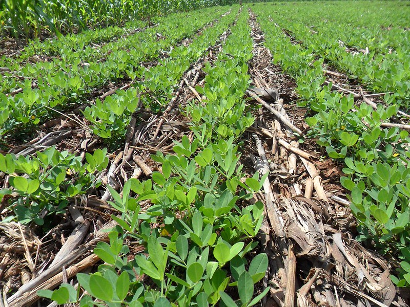

*Examples of Conservation Agriculture include: no tillage, crop residue retention as mulch, and crop rotations. Work with your local [Conservation District](https://www.nacdnet.org/) for assistance.*

:::info [Help us track this Solution](contribute)
This a sample ChatGPT page to get the ball rolling.

[Click here to contribute content and feedback](contribute)
:::

        
List of companies working in this solution...

         <em>Note: this is an experimental feature. Accuracy not guaranteed</em>
        

            <ul>
             
                <li><a href="https://pivotbio.com">Pivot Bio</a></li>
            
                <li><a href="https://protix.eu">Protix</a></li>
            
                <li><a href="https://OLIOex.com">Olio</a></li>
            
                <li><a href="https://nan">Entocycle</a></li>
            
                <li><a href="https://lawrencedale.com">Leaf</a></li>
            
                <li><a href="https://nan">Climate Tech List</a></li>
            
            </ul>
        

        

:::company job openings
  #### [View open jobs in this Solution](https://climatebase.org/jobs?l=&q=&drawdown_solutions=Conservation+Agriculture)
:::

## Overview

* Significant progress in **Conservation Agriculture** for climate change reversal.
* Technologies developed: **reduce tillage, increase yields, store soil carbon**.
* Resulting **greenhouse gas emissions reduction**.
* Leading entities: **Conservation Technology Information Center, Natural Resources Conservation Service, Environmental Defense Fund**.

## Progress Made

* Notable advancements in Conservation Agriculture for climate change.
* Key technologies: **no-till farming, cover crops, crop rotation**.
* Pioneer organizations: **Conservation Technology Information Center, Soil and Water Conservation Society**.

## Lessons Learned

* Essential to **involve farmers** in the development and implementation process.
* Provide **adequate training and support** to farmers.
* Ensure technology is **affordable and accessible**.
* **Monitor and evaluate** technology use for effectiveness and adjustments.

## Challenges Ahead

* Main challenges:

  1. **Increase global adoption** of Conservation Agriculture.
  2. **Scale up** to meet farmer needs.
  3. **Enhance productivity** of Conservation Agriculture systems.
* Obstacles:

  1. Viewed as **new and unproven** technology.
  2. **Initial investment** barrier for many farmers.
  3. Potential **short-term productivity drop** as soil recovers.
* Prominent promoter: **Conservation Agriculture Initiative** (partnership including FAO).

## Best Path Forward

* No single solution to climate change, but Conservation Agriculture is promising.
* Benefits: **reduced emissions, improved soil health, increased water efficiency**.
* Key steps:

  1. **Raise awareness** of Conservation Agriculture benefits.
  2. Make it **more affordable and accessible**.
  3. **Provide technical assistance** to farmers.
  4. **Monitor and evaluate** for effectiveness.
* Leading promoters: **Conservation Agriculture Network, FAO, World Wildlife Fund**.