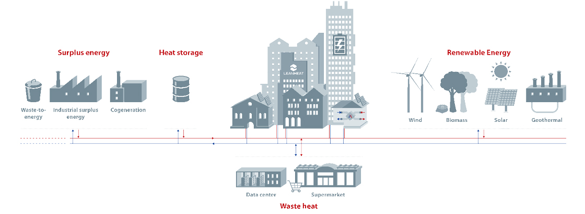

:::info [Help us track this Solution](contribute)
This a sample ChatGPT page to get the ball rolling.

[Click here to contribute content and feedback](contribute)
:::

## Overview

District heating is a system distributing heat from a central source to multiple buildings.

By eliminating the need for individual heating systems in each building, it has the potential to significantly reduce greenhouse gas emissions.

Enhanced by technologies like "enhanced geothermal systems" (EGS), which inject water into hot rock formations for efficient heat capture, district heating offers promise for large-scale power generation.

Key players in this field include the International District Energy Association, the District Energy in Buildings Initiative, and the Carbon Trust.

## Progress Made

District heating's progress:
- Centrally produces and distributes heat via insulated pipes.
- Recent technological advancements enhance efficiency.
- High-temperature district heating systems with temperatures up to 140°C boost efficiency and reduce emissions.

Leading contributors to high-temperature district heating technology:
- Aalborg Energie Technik
- Danfoss
- Eloq
- Fortum
- Siemens

## Lessons Learned

Lessons from district heating development:
- **Careful planning and execution** are vital due to system complexity.
- **Reliable heat source** and infrastructure are challenges.
- Overcoming challenges requires coordination among stakeholders like utility companies, government agencies, and private developers.
  
## Challenges Ahead

Challenges in district heating development:
1. **High upfront cost**: Significant investment required.
2. **Reliable heat source**: Ensuring constant heat availability.
3. **Robust infrastructure**: Developing and maintaining pipe networks.

## Best Path Forward

To drive the development of district heating and its role in climate change mitigation:
- **Raise awareness**: Educate about technology benefits.
- **Government and industry support**: Foster development and implementation.
- **Robust regulatory framework**: Encourage district heating adoption.
- **Efficiency in design and operation**: Ensure optimal system functioning.

## Promising Outlook

District heating, with proper policies, could fulfill up to one-third of the world's heating needs by 2050, according to the International Energy Agency (IEA). Awareness raising, support from government and industry leaders, robust regulations, and efficient system operation are essential steps in making district heating a significant contributor to climate change mitigation.

---

Image credt: [Dan Foss](https://www.danfoss.com/en-us/markets/district-energy/dhs/district-heating/#tab-overview)
