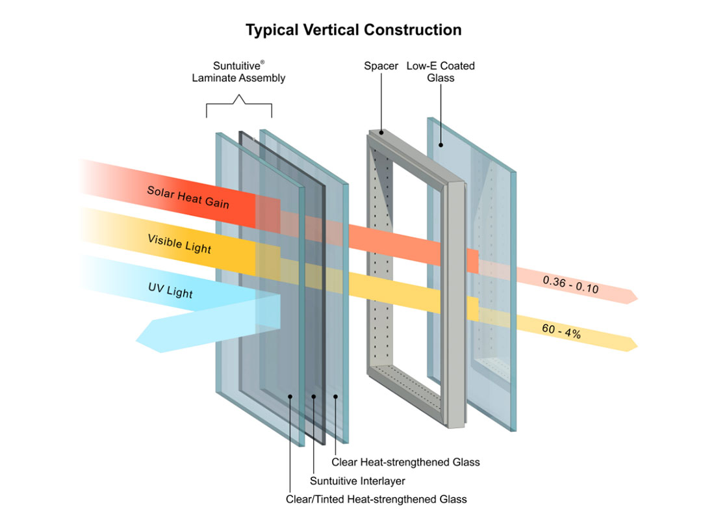

:::company job openings
  #### [View open jobs in this Solution](https://climatebase.org/jobs?l=&q=&drawdown_solutions=Dynamic+Glass)
:::

## Overview

Dynamic Glass refers to advanced coatings applied to glass, enabling dynamic adjustments to sunlight and temperature for enhanced energy efficiency. These coatings offer potential benefits in reducing energy consumption for heating and cooling, as well as improving solar panel efficiency.

## Lessons Learned

Insights from Dynamic Glass development include:

1. **Technology Stage**: Dynamic Glass is still in its early stages, with both successes and failures.
2. **Effective Implementation**: Proper installation and compatibility with local climate are critical.
3. **Diverse Successes**: While challenges exist, Dynamic Glass has been effective in scenarios like office buildings' energy reduction.

Pioneering organizations such as the US Department of Energy, the Environmental Protection Agency, and the Department of Defense have been instrumental in researching and testing this technology.

## Challenges Ahead

Challenges in implementing Dynamic Glass comprise:

1. **High Costs**: Current technology costs need reduction for wider adoption.
2. **Enhancing Efficiency**: Improving energy efficiency is vital to attract more users.
3. **Overcoming Technological Hurdles**: Companies like Saint-Gobain and View, Inc. are making progress, but hurdles remain.

## Best Path Forward

Tailored approaches are essential for the development and application of Dynamic Glass. Key lessons include:

1. **Clear Objectives**: Defining achievable goals aligned with climate change mitigation.
2. **Thorough Testing**: Rigorous research and testing to ensure technology effectiveness.
3. **Expert Collaboration**: Partnering with reputable manufacturers for quality assurance.
4. **Effective Marketing**: Communicating technology benefits through comprehensive strategies.

Entities at the forefront of Dynamic Glass development include Sage Electrochromics, View, Heliotrope Technologies, GlasSmart, PPG Industries, Guardian Industries, Saint-Gobain, and Pilkington.

_Image credit: [Sunintuitive Glass](https://suntuitiveglass.com/what-is-dynamic-glass/)_
