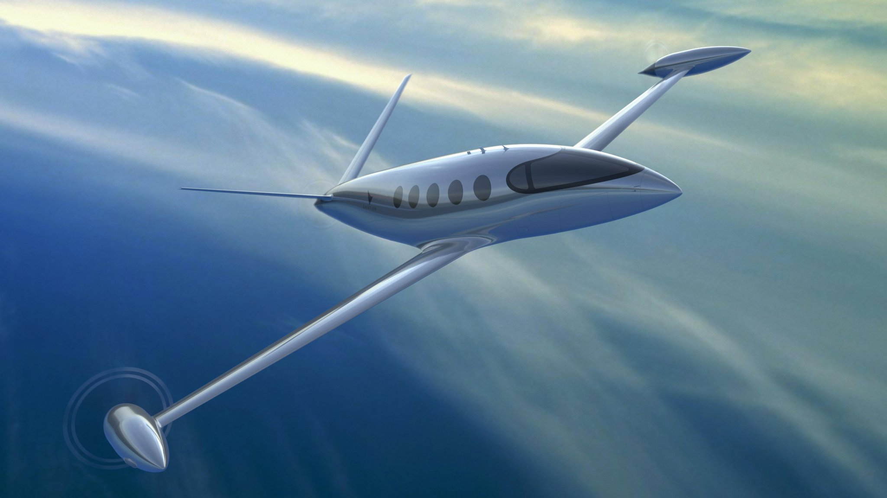

_Image Credit: [Financial Times](https://www.ft.com/content/a9dc81d2-725e-11e9-bf5c-6eeb837566c5)_

:::company job openings
  #### [View open jobs in this Solution](https://climatebase.org/jobs?l=&q=&drawdown_solutions=Efficient+Aviation)
:::

## Overview

- **Efficient Aviation**: Focuses on technology to reverse climate change.
- **Breakthrough Technologies**: Efficient engines and fuel-efficient airplanes.
- Collaboration with companies and organizations to reduce emissions.

### Sustainable Aviation Fuel

Introduction:

<iframe 
  allow="autoplay *; encrypted-media *; fullscreen *; clipboard-write" 
  frameBorder="0" 
  height="175" 
  style={{width:'100%', maxWidth:'660px', overflow:'hidden', borderRadius:'10px'}} 
  sandbox="allow-forms allow-popups allow-same-origin allow-scripts allow-storage-access-by-user-activation allow-top-navigation-by-user-activation" 
  src="https://embed.podcasts.apple.com/gb/podcast/episode-29-sustainable-aviation-fuel/id1544729925?i=1000630920514"
/>

[Boeing's project](https://sustainabilitytogether.aero/)

## Progress Made

- **Electric Aircraft and Fuel Cells**: Developed by Airbus, Boeing, and Rolls-Royce.
- **Collaboration with Governments**: Policies supporting technology adoption.
- **Reducing Greenhouse Gas Emissions**: Emissions from flights and distance reduced.

## Lessons Learned

1. **Not a Silver Bullet**: Technology isn't sole solution, consider aircraft, fuel, and operations.
2. **Continuous Improvement**: Evolving technology needs regular updates.
3. **Complementary Measures**: Combine technology with alternative fuels for optimal results.
4. **Monitoring and Regulation**: Careful oversight and regulation required.
5. **Cross-Industry Support**: Industry, fuel, government support needed.

## Challenges Ahead

1. **Scaling Up**: Investment needed for research, facilities, and infrastructure.
2. **Overcoming Obstacles**: High costs, regulatory approval, and awareness challenges.
3. **Key Players**: Airbus, Boeing, Virgin Atlantic, International Civil Aviation Organization.
4. **Achievements**: Testing aircraft, engines, fuel-saving technologies, international agreements.

## Best Path Forward

- **Develop and Improve**: Enhance compatibility, accessibility, and cost-effectiveness.
- **Raise Awareness**: Educate, incentivize, and regulate to encourage adoption.
- **Monitor and Evaluate**: Ensure emission reduction effectiveness and make adjustments.
- **Key Organizations**: Airbus, Boeing, Rolls-Royce, International Air Transport Association.
- **Global Progress**: International Civil Aviation Organization targets 50% emission reduction by 2050.
- **Airlines Commitment**: Carbon-neutral goals, efficient aircraft, alternative fuels.
- 
