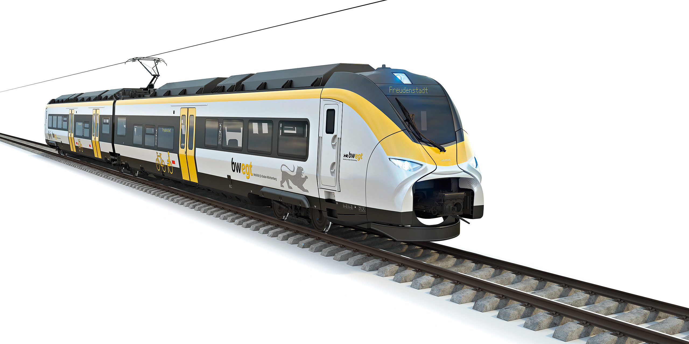

_Siemens battery-electric train ([Green Car Reports](https://www.greencarreports.com/news/1127629_battery-powered-electric-trains-will-soon-bring-cleaner-air-especially-in-europe))_

        
List of companies working in this solution...

         <em>Note: this is an experimental AI feature. Accuracy and completeness are a work in progress</em>
        

            <ul>
             
                <li><a href="https://kickstarter.com/projects/karmi…">Karmic Bikes</a></li>
            
                <li><a href="https://ojoelectric.com">Ojo</a></li>
            
            </ul>
        

        

:::company job openings
  #### [View open jobs in this Solution](https://climatebase.org/jobs?l=&q=&drawdown_solutions=Electric+Trains)
:::

## Overview
**Climate Technology Solution**: Electric Trains

## Progress Made
- **Efficiency Advancements**: Development of hybrid, battery, solar, and wind electric trains.
- **Emission Reduction**: Electric trains offer emission reduction of up to 90%.
- **Prominent Players**: Siemens, Alstom, Bombardier, Amtrak leading in electric train technology.

## Lessons Learned
- **Efficiency Benefits**: Electric trains outperform traditional diesel-powered options.
- **Zero Emissions**: Electric trains contribute to reduced pollution and climate mitigation.
- **Cost Savings**: Initial investment offset by long-term fuel and maintenance savings.
- **Reliable Power**: Dependable power supply is crucial for electric train operations.
- **Global Adoption**: Increasing popularity and investments in electric train technology.

## Challenges Ahead
- **Cost Hurdles**: Higher initial cost compared to diesel counterparts.
- **Infrastructure Need**: Electrified rail lines entail costly infrastructure development.
- **Energy Efficiency**: Focus on enhancing energy efficiency of electric trains.
- **Reliability Concerns**: Addressing power-related issues to ensure consistent operation.

## Best Path Forward
- **Policy Support**: Implement supportive policies, incentives for electrification targets.
- **Infrastructure Investment**: Develop charging stations, electrified lines, manufacturing facilities.
- **Awareness Campaigns**: Educate public about benefits of electric trains and climate mitigation.

## Key Players
- **Industry Leading**: Siemens, Alstom, Bombardier, Amtrak, Canadian National Railway.
- **Global Governments**: UK, Norway, Canada support electric train projects.
- **Research Contributions**: Universities and research centers aiding development.

