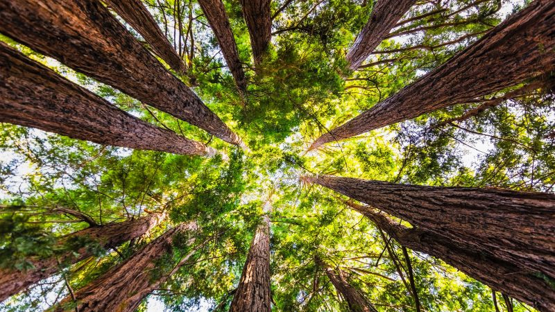

*Image Credit: [Euractiv](https://www.euractiv.com/section/energy-environment/opinion/seven-steps-to-curb-deforestation-and-enhance-forest-protection-looking-beyond-eu-only-solutions/)*

:::info [Help us track this Solution](contribute)
This a sample ChatGPT page to get the ball rolling.

[Click here to contribute content and feedback](contribute)
:::

## Overview

* Significant advancements in **forest protection** to combat climate change.
* Development of technologies for **capture and storage of carbon dioxide emissions** from industrial sectors.
* Forest protection technologies ensure **sustainable forest management**.
* Implementation of **policies and regulations** promoting the reduction of greenhouse gas emissions.

## Progress Made

* Progress witnessed in forest protection techniques.
* **REDD+**: A notable technology offering incentives to landowners to protect forests, leading to a reduction in greenhouse gas emissions.
* **Forest management planning tools** assist landowners in comprehending the value and benefits of forest protection.
* Pioneer organizations in this domain include **The Nature Conservancy and the World Wildlife Fund**.

## Lessons Learned

* Importance of **clear planning** in forest protection.
* Forest protection demands **collaborative efforts** among government, industry, and NGOs.
* Necessity for clear **economic incentives** for corporate participation.
* **Science-based protection strategies** are essential.
* The approach must be **adaptable** to changing climatic conditions.

## Challenges Ahead

* The primary challenge remains the **lack of funding**.
* Despite efforts by private entities, progress is slowed due to **financial constraints**.

## Best Path Forward

* **Raise public awareness** about the significance of forest protection in countering climate change effects.
* Engage with governmental bodies to establish **incentives for private landowners** for forest protection.
* **Research** to devise more potent and efficient forest protection methods.
* Provide **support in terms of funding and technical expertise** for forest protection initiatives.