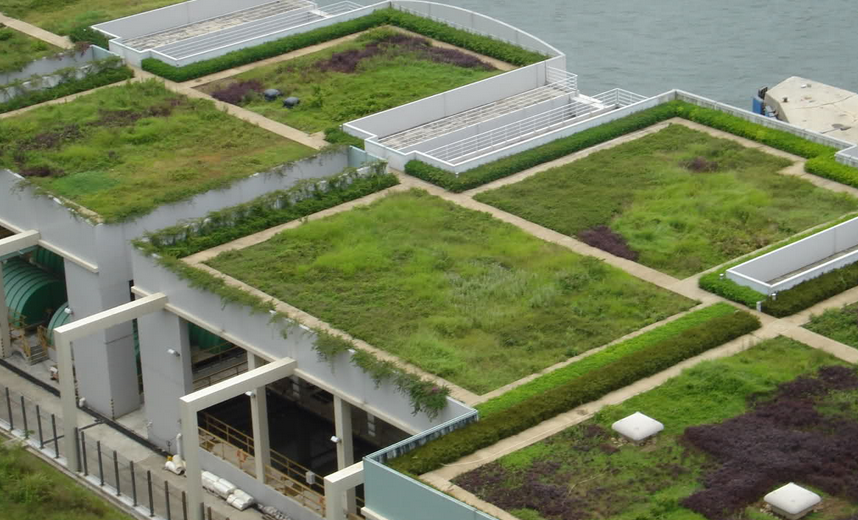

:::info [Help us track this Solution](contribute)
This a sample ChatGPT page to get the ball rolling.

[Click here to contribute content and feedback](contribute)
:::

        
List of companies working in this solution...

         <em>Note: this is an experimental feature. Accuracy not guaranteed</em>
        

            <ul>
             
                <li><a href="https://iglcoatings.com">Igl Coatings</a></li>
            
            </ul>
        

        

:::company job openings
  #### [View open jobs in this Solution](https://climatebase.org/jobs?l=&q=&drawdown_solutions=Green+and+Cool+Roofs)
:::

## Overview

Green and cool roofs are innovative strategies to combat climate change by mitigating the urban heat island effect and reducing energy consumption. Green roofs are adorned with vegetation, while cool roofs are coated with reflective materials, helping to curb heat absorption and enhancing energy efficiency.

## Progress Made:

 - **Modular green roofs** - these are pre-vegetated green roofs that can be easily installed on a building. 

 - **Living roofs** - green roofs that have a layer of soil and vegetation that is alive and growing.

 - **Companies and organizations** - Green Roofs for Healthy Cities, the Green Roof Infrastructure Services group, and the Living Roof Company.

## Lessons Learned

Insights from the development and application of green and cool roofs include:

1. **Urban Heat Island Mitigation**: These roofs aid in reducing cooling energy demand by 20-40%, mitigating the urban heat island effect.
2. **Stormwater Management**: They also assist in decreasing stormwater runoff, lessening sewer system strain and flood risks.
3. **Air Quality Improvement**: Green roofs and cool roofs can trap pollutants and offer urban green spaces for enhanced air quality.
4. **Implementation Challenges**: Considerations like building codes, costs, and maintenance are crucial during project planning.
5. **Leading Entities**: Prominent organizations driving green and cool roofs are the International Green Roof Association, Cool Roof Rating Council, and Green Roofs for Healthy Cities.

## Challenges Ahead

The International Energy Agency emphasizes the need for substantial growth in solar energy installations to meet climate targets. Challenges in the solar thermal sector include:

1. **Enhancing Efficiency**: Solar thermal technology must become more efficient, with higher energy conversion rates.
2. **Cost Reduction**: Solar thermal costs need to be lowered, approaching competitiveness with other heating technologies.
3. **Scaling Up Capacity**: Dramatic increase in installed capacity is essential to meet climate goals.
4. **Market Share Growth**: The solar thermal industry requires a larger portion of the heating and cooling market.

Several key players actively involved in the solar thermal sector include the Solar Heating and Cooling Programme of the International Renewable Energy Agency (IRENA), the Solar Energy Industries Association (SEIA), the Solar Thermal World Council (STWC), and the International Solar Energy Society (ISES).

## Best Path Forward

To drive the continued development and adoption of green and cool roofs, the following steps are vital:

1. **Public Awareness**: Education about the benefits of these roofs is crucial.
2. **Incentives**: Providing incentives for residential and commercial installations is essential.
3. **Continuous Improvement**: Ongoing enhancement of technology is necessary.

Leading organizations in this field include the Cool Roof Rating Council (CRRC) and the U.S. Green Building Council (USGBC), both contributing to energy-efficient roofing practices. Cities like San Francisco, Chicago, and New York City have implemented ordinances and initiatives to promote green and cool roofs.

The rising adoption of green and cool roofs can be attributed to increased climate change awareness, accompanied by improved technology and available incentives.