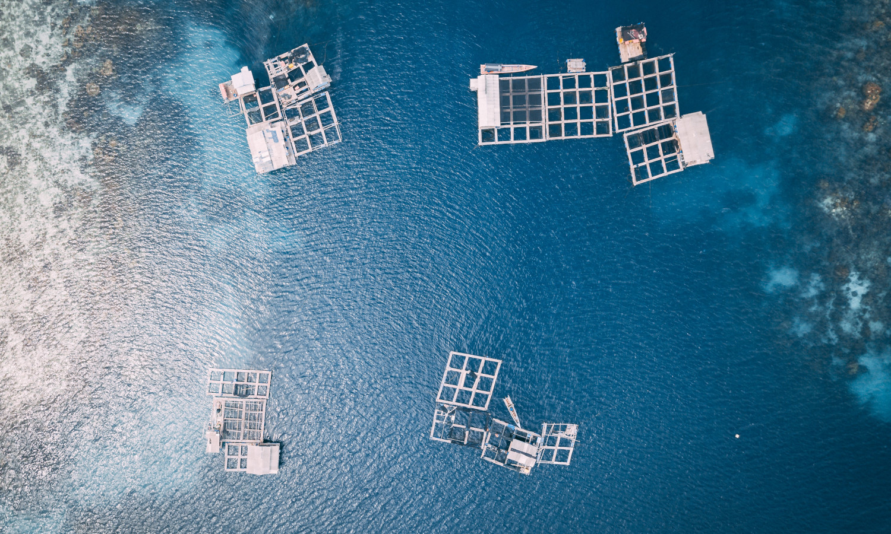

Aquaculture, the cultivation of fish, shellfish, and other aquatic life, has seen a surge in growth, providing a vital food source globally. Sustainable aquaculture practices have the potential to reduce greenhouse gas emissions and mitigate the impacts of overfishing.

*Image credit: [foodtank.com](https://foodtank.com/news/2021/07/new-report-shows-sustainability-in-global-aquaculture/)*

:::company job openings
### [View open jobs in this Solution](https://climatebase.org/jobs?l=&q=&drawdown_solutions=Improved+Aquaculture)
#### Example Companies
- [AquaBounty Technologies](https://www.aquabounty.com) - Develops genetically engineered salmon for faster growth and sustainability.
- [Global Aquaculture Alliance](https://www.aquaculturealliance.org) - Promotes sustainable aquaculture practices worldwide.
- [World Wildlife Fund (WWF)](https://www.worldwildlife.org) - Advocates for sustainable aquaculture through various initiatives.
- [Marine Harvest](https://www.marineharvest.com) - One of the largest seafood companies focusing on sustainable aquaculture.
- [Cargill Aqua Nutrition](https://www.cargill.com) - Provides sustainable feed solutions for aquaculture.
:::

## Overview

Aquaculture, the cultivation of fish, shellfish, and other aquatic life, has seen a surge in growth, providing a vital food source globally. The potential for aquaculture to reduce greenhouse gas emissions has been recognized. A paradigm shift towards sustainability is evident in global aquaculture, given overfishing and the rising demand for seafood.

:::info Learn More
- [New Report Shows Sustainability in Global Aquaculture](https://foodtank.com/news/2021/07/new-report-shows-sustainability-in-global-aquaculture/) - Food Tank
- [Aquaculture Innovation Challenge](https://www.aquacultureinnovation.com) - WWF and the Gordon and Betty Moore Foundation
- [Global Aquaculture Alliance](https://www.aquaculturealliance.org) - Promotes sustainable aquaculture practices worldwide
:::

## Progress Made

Significant advancements have been made in sustainable aquaculture practices:

1. **Aquaponics**: Symbiotic cultivation of fish and plants, resulting in efficient food production and a minimized carbon footprint.
2. **Recirculating Aquaculture Systems (RAS)**: Water-efficient systems that lessen the environmental impact of aquaculture.
3. **Offshore Aquaculture**: Operated in the open ocean, it diminishes the strain on coastal ecosystems.

Key proponents of sustainable aquaculture include:

- **Aquaculture Stewardship Council (ASC)**
- **Global Aquaculture Alliance (GAA)**
- **World Wildlife Fund (WWF)**

## Solutions by Sector

### Aquaponics
- **Integrated Systems**: Combining fish farming with hydroponics to create a closed-loop system.
- **Urban Farming**: Implementing aquaponics in urban settings to provide fresh produce and fish.
- **Educational Programs**: Teaching communities about sustainable food production through aquaponics.

**Case Studies:**
1. **Backyard Aquaponics, Australia**: Provides DIY aquaponics kits and systems for home use ([Backyard Aquaponics](https://www.backyardaquaponics.com)).
2. **Nelson and Pade, USA**: Offers commercial aquaponics systems and training ([Nelson and Pade](https://www.aquaponics.com)).
3. **Urban Organics, USA**: Operates large-scale aquaponics farms in urban areas ([Urban Organics](https://urbanorganics.com)).

### Recirculating Aquaculture Systems (RAS)
- **Water Recycling**: Reusing water within the system to reduce waste and environmental impact.
- **Biofiltration**: Using biological filters to maintain water quality and support fish health.
- **Energy Efficiency**: Implementing energy-efficient technologies to reduce operational costs.

**Case Studies:**
1. **Superior Fresh, USA**: Operates the largest aquaponics facility in North America using RAS ([Superior Fresh](https://www.superiorfresh.com)).
2. **Atlantic Sapphire, USA**: Uses RAS technology to farm salmon sustainably ([Atlantic Sapphire](https://atlanticsapphire.com)).
3. **Kingfish Zeeland, Netherlands**: Produces yellowtail kingfish using RAS ([Kingfish Zeeland](https://www.kingfish-zeeland.com)).

### Offshore Aquaculture
- **Open Ocean Farming**: Raising fish in offshore environments to reduce the impact on coastal ecosystems.
- **Advanced Monitoring**: Using technology to monitor and manage offshore farms.
- **Sustainable Practices**: Implementing practices that minimize environmental impact and promote fish health.

**Case Studies:**
1. **Blue Ocean Mariculture, USA**: Operates offshore fish farms in Hawaii ([Blue Ocean Mariculture](https://www.bofish.com)).
2. **SalMar ASA, Norway**: Pioneers offshore salmon farming with advanced technology ([SalMar](https://www.salmar.no)).
3. **Ocean Farm 1, Norway**: World's first offshore fish farm, designed to withstand harsh ocean conditions ([Ocean Farm 1](https://www.oceanfarm.no)).

## Lessons Learned

1. **Planning**: A unified vision involving all stakeholders is fundamental.
2. **Water Quality Monitoring**: Regularly ensuring optimal water conditions is critical for aquatic health.
3. **Quality Feed**: Directly impacts the health and growth of fish.
4. **Waste Management**: Proper disposal is crucial to prevent water pollution.
5. **Renewable Energy**: Essential for a reduced carbon footprint.

## Challenges Ahead

1. **Scalability**: Widening the adoption of sustainable aquaculture is hindered by public awareness, funding, and political support.
2. **Public Awareness**: Largely, the populace is uninformed about its potential.
3. **Funding**: Insufficient R&D investment.
4. **Political Support**: Lacking in many regions.

Leading the charge in innovation is **AquaBounty Technologies**, developing faster-growing salmon.

## Best Path Forward

1. **Awareness Building**: Broaden understanding among producers and the public.
2. **Research & Development**: Optimize techniques for varied systems.
3. **Financial Incentives**: Promote adoption of improved aquaculture technologies.
4. **Regulations & Standards**: Advocate for the broad application of sustainable practices.

Champions in sustainable aquaculture development include:

- **World Aquaculture Society**
- **Aquaculture Stewardship Council**
- **Global Aquaculture Alliance**

*Image credit: [foodtank.com](https://foodtank.com/news/2021/07/new-report-shows-sustainability-in-global-aquaculture/)*
