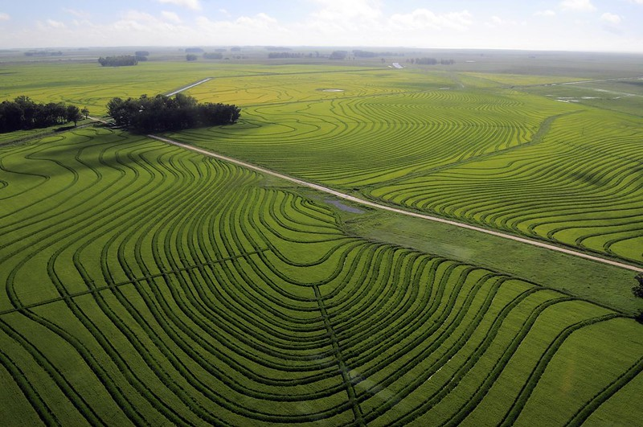

*Rice production in Eastern Uruguay* 

:::info [Help us track this Solution](contribute)
This a sample ChatGPT page to get the ball rolling.

[Click here to contribute content and feedback](contribute)
:::

## Overview

* The **Green Revolution** was a pivotal moment in history where agricultural advancements, such as fertilizers, pesticides, and irrigation methods, significantly boosted food production. Although beneficial for food security, these techniques led to environmental issues like soil degradation and water contamination.
* Rice production, which is central to global food supply, can benefit from sustainable farming methods. Techniques like no-till farming help reduce carbon emissions and maintain soil health.
* The **International Rice Research Institute (IRRI)** is crucial in pioneering advanced rice cultivation techniques. Their work has spawned developments such as precision farming and organic fertilizer application.

## Progress Made

* **Improved Seed Varieties**: Plant breeders have created high-yield, environment-resilient rice strains, which optimize production and cut greenhouse gas emissions.
* **Water Management**: The development of water-efficient irrigation techniques has lessened water wastage and the overall water footprint of rice cultivation.
* **Fertilizer Management**: Farmers now utilize effective fertilizer management strategies, optimizing fertilizer use and reducing related emissions.
* **Crop Rotation**: Innovative crop rotations that incorporate rice reduce emissions and enrich the soil.
* **Pest Management**: Environment-friendly pest management minimizes the use of harmful chemicals, reducing pollution.

## Lessons Learned

* The technology must be properly designed and implemented in order to be effective.
* There have been some failures associated with the technology, but these have generally been due to incorrect implementation rather than the technology itself.

## Challenges Ahead

* **Yield Enhancement**: To feed the growing global population, rice yields need a significant boost.
* **Water Usage**: Rice cultivation is water-intensive. To make rice farming more sustainable, we need to curtail the water used per kilogram of rice produced.
* **Reducing Chemical Dependency**: Minimizing fertilizer and pesticide use remains a challenge, given their environmental impact.

## Best Path Forward

* Prioritize **Research and Development**: Continued investment in technology advancement is essential.
* **Educate Farmers**: Empowering farmers with the knowledge of these new techniques and understanding their benefits is pivotal.
* **Provide Incentives**: Encourage farmers to embrace these sustainable methods through incentives.

- - -

*Image credit: © 2012CIAT/NeilPalmer via [Flickr](https://www.flickr.com/photos/ciat/6809968788)*