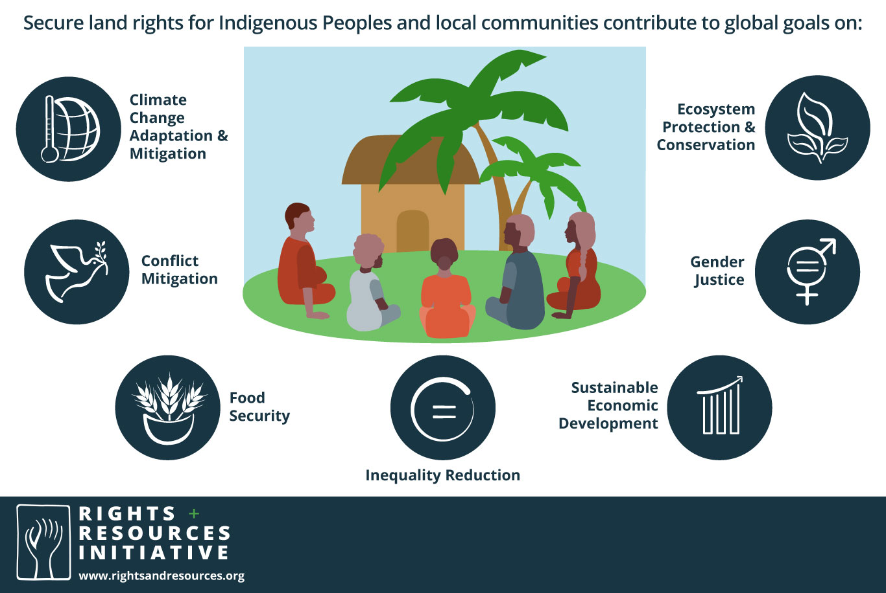

Securing land tenure for Indigenous Peoples is essential for sustainable forest management, biodiversity conservation, and climate change mitigation.

Indigenous peoples play a crucial role in environmental conservation. They make up around 5% of the global population but occupy, own, or manage approximately 25% of the world’s land surface (including about 40% of all terrestrial protected areas) and hold 80% of the planet’s biodiversity (Garnett et al., [2018](https://onlinelibrary.wiley.com/doi/full/10.1111/1745-5871.12610#geor12610-bib-0017))

*Benefits of securing land tenure for indigenous people* **([Rights and Resources](https://rightsandresources.org/learnmore/))**

:::company job openings
### [View open jobs in this Solution](https://climatebase.org/jobs?l=&q=&drawdown_solutions=Indigenous+Peoples+Forest+Tenure)
#### Example Organizations
- [World Resources Institute](https://www.wri.org) - Supports sustainable forest management and Indigenous land rights.
- [Rights and Resources Initiative](https://rightsandresources.org) - Advocates for Indigenous land tenure and forest rights.
- [Forest Peoples Programme](https://www.forestpeoples.org) - Works to secure the rights of forest-dependent peoples.
- [Indigenous Peoples' Climate Change Assessment Initiative](https://ipcca.info) - Focuses on Indigenous-led climate change assessments.
- [The Tenure Facility](https://thetenurefacility.org) - Provides funding and support for securing land tenure for Indigenous Peoples.
:::

## Overview

Indigenous Peoples’ forest tenure involves securing land rights for Indigenous communities to manage and protect their forests. This approach leverages traditional knowledge and sustainable practices to reduce greenhouse gas emissions and enhance biodiversity.

:::info Learn More
- [Rights and Resources Initiative](https://rightsandresources.org/learnmore) - Learn more about the benefits of securing land tenure for Indigenous Peoples.
- [World Resources Institute - Forest Tenure](https://www.wri.org/our-work/project/forest-tenure-and-resource-rights) - Information on forest tenure and resource rights.
- [Forest Peoples Programme](https://www.forestpeoples.org) - Advocates for the rights of forest-dependent peoples.
:::

## Progress Made

Significant advancements have been made in securing Indigenous Peoples' forest tenure:

1. **Technological Advancements**: Use of satellite imagery, drones, and GIS in forest management.
2. **Carbon Offsetting**: Developed to reduce emissions and support Indigenous land rights.
3. **Investments**: Businesses offset emissions by investing in projects like wind farms and forest conservation.

Key organizations supporting these initiatives include:

- **Forest Carbon Partnership Facility** (a World Bank initiative)
- **World Bank**
- **Global Forest Watch**

## Solutions by Sector

### Technological Advancements
- **Satellite Imagery**: Monitoring forest cover and detecting deforestation.
- **Drones**: Providing aerial views for better forest management.
- **GIS**: Mapping land boundaries and resources for effective planning.

**Case Studies:**
1. **Global Forest Watch**: Uses satellite technology to monitor forests in real-time ([Global Forest Watch](https://www.globalforestwatch.org)).
2. **Rainforest Foundation US**: Employs drones and GIS to support Indigenous land rights in the Amazon ([Rainforest Foundation US](https://www.rainforestfoundation.org)).
3. **World Resources Institute**: Provides tools and data for forest monitoring and management ([World Resources Institute](https://www.wri.org)).

### Community Capacity Building
- **Training Programs**: Educating Indigenous communities on sustainable forest management.
- **Resource Management**: Empowering communities to manage their resources effectively.
- **Legal Support**: Assisting in securing legal recognition of land rights.

**Case Studies:**
1. **Forest Peoples Programme**: Provides training and legal support to forest-dependent communities ([Forest Peoples Programme](https://www.forestpeoples.org)).
2. **The Tenure Facility**: Funds projects to secure land tenure for Indigenous Peoples ([The Tenure Facility](https://thetenurefacility.org)).
3. **Indigenous Peoples' Climate Change Assessment Initiative**: Focuses on Indigenous-led climate change assessments ([IPCCA](https://ipcca.info)).

### Policy and Advocacy
- **International Agreements**: Promoting policies that recognize Indigenous land rights.
- **National Legislation**: Supporting the implementation of laws that protect Indigenous territories.
- **Public Awareness Campaigns**: Educating the public about the importance of Indigenous land rights.

**Case Studies:**
1. **Rights and Resources Initiative**: Advocates for policies that secure land tenure for Indigenous Peoples ([Rights and Resources Initiative](https://rightsandresources.org)).
2. **UN Development Programme**: Supports Indigenous land rights through various initiatives ([UNDP](https://www.undp.org)).
3. **World Bank**: Funds projects that support Indigenous land rights and sustainable forest management ([World Bank](https://www.worldbank.org)).

## Lessons Learned

1. **Indigenous Voice**: Essential in decision-making about forest tenure.
2. **Capacity Building**: Crucial to empower Indigenous communities for effective forest management.
3. **Financing**: Long-term financial commitments required, including innovative mechanisms like carbon offsetting.
4. **Awareness**: Necessity to spread knowledge about Indigenous forest tenure initiatives.
5. **Collaborative Efforts**: Success depends on collaboration among governments, NGOs, and Indigenous communities.

## Challenges Ahead

1. **Awareness Gap**: Both among Indigenous Peoples and policymakers.
2. **Support Lacking**: Financial and technical support for Indigenous-led forest tenure systems.
3. **Research Needed**: Effectiveness of various forest tenure types.
4. **Policy Implementation**: Ensuring policies are effectively implemented and enforced.

## Best Path Forward

1. **Traditional Knowledge**: Invest in Indigenous knowledge for sustainable forest management.
2. **Community Capacity**: Enhance Indigenous communities' ability to manage their forest tenure systems.
3. **Awareness and Training**: Continued efforts needed to make Indigenous forest tenure widespread.
4. **Financial Incentives**: Provide financial support for sustainable forest management practices.
5. **Policy Support**: Implement policies that recognize and protect Indigenous land rights.

*Image credit: [Rights and Resources](https://rightsandresources.org/learnmore)*
