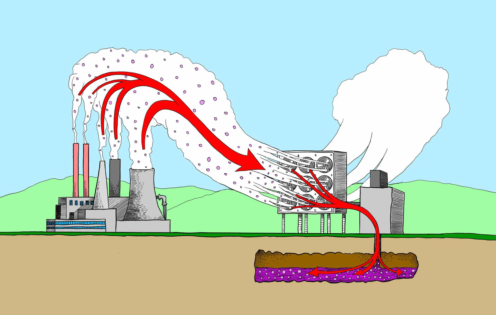

:::company Job openings
### [View open jobs in this Sector](https://climatebase.org/jobs?l=&q=&sectors=Carbon+Removal+Tech&p=0&remote=false)

Then come back to learn more about this [Solution](#solutions-in-this-sector)
:::

:::podcast Podcast episodes
- [MIT Climate Portal - explainer](https://climate.mit.edu/explainers/carbon-capture)
- [Open Air Collective](https://openaircollective.com)
- [Global CCS Institute](https://www.globalccsinstitute.com/)
- [Carbon Capture & Storage Association (CCSA)](https://www.ccsassociation.org/)
:::

## Resources:

:::info
- [MIT Climate Portal - explainer](https://climate.mit.edu/explainers/carbon-capture)
- [Open Air Collective](https://openaircollective.com)
- [Global CCS Institute](https://www.globalccsinstitute.com/)
- [Carbon Capture & Storage Association (CCSA)](https://www.ccsassociation.org/)
:::

<iframe 
  allow="autoplay *; encrypted-media *; fullscreen *; clipboard-write" 
  frameBorder="0" 
  height="175" 
  style={{width:'100%', maxWidth:'660px', overflow:'hidden', borderRadius:'10px'}} 
  sandbox="allow-forms allow-popups allow-same-origin allow-scripts allow-storage-access-by-user-activation allow-top-navigation-by-user-activation" 
  src="https://embed.podcasts.apple.com/us/podcast/s7-ep2-scaling-carbon-capture-technologies-and-other/id1613789172?i=1000632682124"
/>

## Understanding the Carbon Capture Industry:

* Methods of Carbon Capture: Pre-combustion, post-combustion, and oxy-fuel combustion.
* Storage & Utilization: Geological storage, mineralization, and utilization in products or chemical processes.

## Required Background & Experience:

* Technical Roles: Degrees in environmental engineering, chemical engineering, geology, or related fields.
* Policy & Management: Degrees in environmental policy, business administration, or related areas.
* Research: Advanced degrees in environmental science, carbon capture technologies, or related specializations.

## Where to Start:

* Internships: CCS-focused companies, environmental NGOs, and research institutions often offer internships.
* Networking: Join industry associations, attend environmental conferences, and connect with professionals in the sector.
* Entry-level Positions: Consider roles in research labs, CCS technology companies, or environmental consultancies.

## Additional Notes:

- [One of the fastest growing carbon removal technologies](https://www.climatetechdistillery.com/p/01-direct-air-capture-dac) - _ClimateDrift_