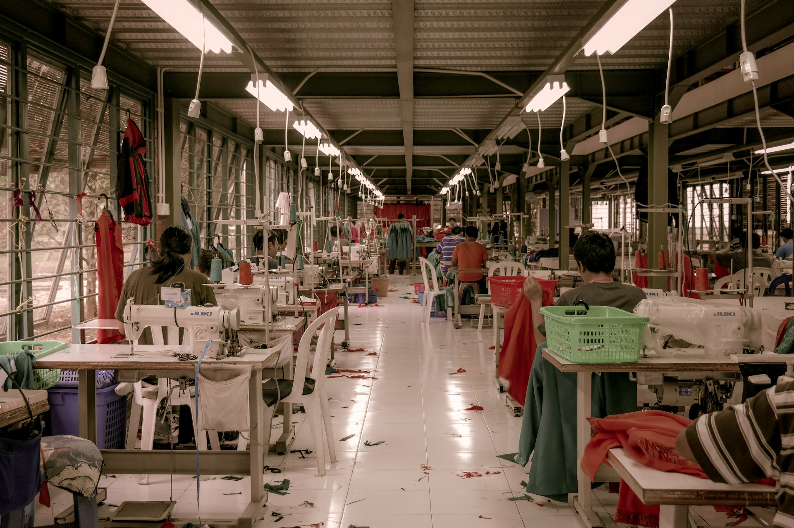

Fast fashion has significant environmental and climate impacts, but innovative solutions are emerging to address these challenges. This page explores the issues and highlights companies and technologies leading the way in sustainable fashion.

:::podcast Podcast episode
[Climate Tech Cocktails on Substack](https://www.climatetechcocktails.com/p/fibe-idan-gal-shohet-a2b)

 Features [Idan Gal-Shohet](https://substack.com/redirect/ae8a7f48-e175-4e65-8e53-53dea01dddc2?j=eyJ1IjoiajBiYjgifQ.qv2JB8uvVdkhUVRdS1py-hgf4il2qGGRog_AnD077d8), the Co-founder and CEO of [Fibe](https://substack.com/redirect/4998ecbd-72c7-4169-9647-db531596d9b5?j=eyJ1IjoiajBiYjgifQ.qv2JB8uvVdkhUVRdS1py-hgf4il2qGGRog_AnD077d8), stitching potato waste into a sustainable cotton fiber substitute. 
:::

:::company job openings
### [View open jobs in this Solution](https://climatebase.org/jobs?l=&q=&drawdown_solutions=Fast+Fashion)
#### Example Companies
- [Patagonia](https://www.patagonia.com) - A leader in sustainable outdoor clothing, focusing on environmental responsibility.
- [Allbirds](https://www.allbirds.com) - Produces eco-friendly footwear using renewable materials.
- [Eileen Fisher](https://www.eileenfisher.com) - Committed to sustainable and ethical fashion practices.
- [Reformation](https://www.thereformation.com) - Designs and manufactures sustainable women's clothing.
- [ThredUp](https://www.thredup.com) - An online consignment and thrift store promoting circular fashion.
:::

## Overview

Fast fashion refers to the rapid production of inexpensive clothing to meet the latest trends. This industry is notorious for its environmental impact, including high water usage, chemical pollution, and significant carbon emissions. Sustainable fashion aims to mitigate these effects through eco-friendly materials, ethical manufacturing practices, and circular economy principles.

## Progress Made

Significant advancements have been made in sustainable fashion technologies and practices:

1. **Eco-Friendly Materials**: Development of sustainable fabrics like organic cotton, recycled polyester, and innovative materials like Piñatex (pineapple leather).
2. **Circular Fashion**: Promotion of recycling, upcycling, and resale of clothing to reduce waste.
3. **Ethical Manufacturing**: Adoption of fair labor practices and environmentally friendly production methods.

## Solutions by Sector

### Materials
- **Sustainable Fabrics**: Using organic, recycled, and biodegradable materials.
- **Innovative Textiles**: Developing new materials like mushroom leather and algae-based fabrics.
- **Dyeing Processes**: Implementing waterless and low-impact dyeing techniques.

**Case Studies:**
1. **Bolt Threads**: Develops Mylo™, a leather alternative made from mycelium ([Bolt Threads](https://www.boltthreads.com)).
2. **Lenzing**: Produces TENCEL™ fibers made from sustainably harvested wood ([Lenzing](https://www.lenzing.com)).
3. **Colorfix**: Uses synthetic biology to create sustainable textile dyes ([Colorfix](https://colorifix.com)).

### Manufacturing
- **Ethical Labor Practices**: Ensuring fair wages and safe working conditions.
- **Energy Efficiency**: Implementing energy-efficient technologies in production facilities.
- **Water Management**: Reducing water usage and improving wastewater treatment.

**Case Studies:**
1. **Reformation**: Implements sustainable practices in manufacturing and supply chain ([Reformation](https://www.thereformation.com)).
2. **Everlane**: Focuses on ethical manufacturing and transparency in their supply chain ([Everlane](https://www.everlane.com)).
3. **Eileen Fisher**: Committed to using organic and recycled materials in their clothing production ([Eileen Fisher](https://www.eileenfisher.com)).

### Consumer Engagement
- **Circular Fashion**: Promoting the resale, recycling, and upcycling of clothing.
- **Sustainable Brands**: Supporting brands committed to environmental and social responsibility.
- **Consumer Education**: Raising awareness about the environmental impact of fashion and encouraging sustainable choices.

**Case Studies:**
1. **ThredUp**: An online consignment and thrift store promoting circular fashion ([ThredUp](https://www.thredup.com)).
2. **Rent the Runway**: Offers clothing rental services to reduce the need for new clothing production ([Rent the Runway](https://www.renttherunway.com)).
3. **Good On You**: Provides ratings and information on brands' ethical and sustainability practices ([Good On You](https://goodonyou.eco)).

## Lessons Learned

1. **Sustainable Materials**: The use of eco-friendly materials is essential for reducing the environmental impact of fashion.
2. **Circular Economy**: Promoting recycling, upcycling, and resale of clothing can significantly reduce waste.
3. **Consumer Awareness**: Educating consumers about the environmental impact of fashion is key to driving sustainable choices.
4. **Transparency**: Brands that are transparent about their supply chains and practices gain consumer trust.

## Challenges Ahead

1. **Cost**: Sustainable fashion can be more expensive than fast fashion, posing a barrier to widespread adoption.
2. **Scale**: Scaling sustainable practices to meet global demand while maintaining profitability.
3. **Consumer Behavior**: Changing deeply ingrained consumer habits towards more sustainable choices.
4. **Supply Chain Complexity**: Ensuring sustainability throughout complex, global supply chains.

## Best Path Forward

1. **Innovation in Materials**: Invest in research and development of sustainable and recycled materials.
2. **Circular Business Models**: Promote rental, resale, and repair services to extend the life of garments.
3. **Consumer Education**: Increase public awareness about the impact of fashion choices and sustainable alternatives.
4. **Policy Support**: Advocate for policies that promote sustainable fashion and hold companies accountable.
5. **Technology Integration**: Leverage AI and blockchain for supply chain transparency and efficiency.

:::info Learn More
- [Ellen MacArthur Foundation - Make Fashion Circular](https://www.ellenmacarthurfoundation.org/our-work/activities/make-fashion-circular)
- [Fashion Revolution](https://www.fashionrevolution.org/)
- [Global Fashion Agenda](https://globalfashionagenda.com/)
:::

Photo by <a href="https://unsplash.com/@riolec?utm_content=creditCopyText&utm_medium=referral&utm_source=unsplash">Rio Lecatompessy</a> on <a href="https://unsplash.com/photos/red-and-white-dining-tables-and-chairs-cfDURuQKABk?utm_content=creditCopyText&utm_medium=referral&utm_source=unsplash">Unsplash</a>